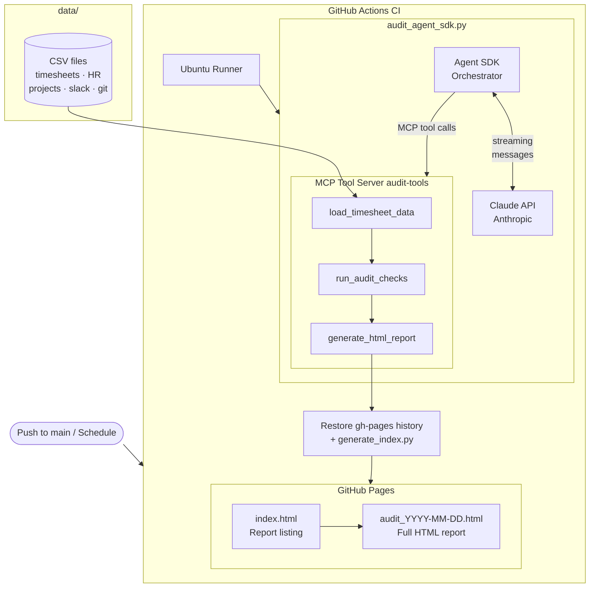

# Agentic AI Timesheet Auditor

A set of [Claude Code](https://claude.ai/code) slash commands that audit,
validate, and correct Kimai timesheet exports using HR, project, Slack, and
git data as reference sources. All logic runs locally with Python 3 stdlib —
no external dependencies.

---

## How it works

```
/timesheet:load-data   →   validate data sources & print summary
/timesheet:audit       →   detect issues across 13 checks
/timesheet:propose-fixes → generate correction plan for review
/timesheet:apply-fixes →   apply approved fixes to the CSV
```

Each command reads directly from the `data/` directory. The audit and
propose-fixes commands are always read-only. Only `apply-fixes` writes to
`kimai_timesheets.csv`, and it always creates a timestamped backup first.

---

## Prerequisites

- [Claude Code](https://claude.ai/code) CLI
- Python 3 (stdlib only — no pip required)
- 8 CSV files in the `data/` directory (see below)

---

## Data sources

Place the following files in `data/` before running any command:

| File | Description |
|------|-------------|
| `kimai_timesheets.csv` | Primary timesheet export from Kimai (audited & corrected) |
| `hr_employees.csv` | Employee roles, canonical hourly rates, status, timezone |
| `hr_assignments.csv` | Which users are authorised to bill which projects |
| `hr_leave.csv` | Approved leave dates per user |
| `pm_projects.csv` | Project names, status (active/archived), budget hours |
| `slack_activity.csv` | Daily Slack message counts per user |
| `git_commits.csv` | Daily git commit counts per user |
| `calendar_events.csv` | Calendar events per user |

---

## Commands

### `/timesheet:load-data`

Validates all 8 files exist and prints a structured summary of each data
source — employee list, project list, leave records, and timesheet overview.

```
/timesheet:load-data
```

Run this first to confirm your data is complete before auditing.

---

### `/timesheet:audit`

Runs 13 checks against `kimai_timesheets.csv` and outputs:
- **Summary** — total CRITICAL / WARNING / INFO issue counts
- **Issues table** — every issue as `User | Date | Issue`, sorted by severity
- **Detailed findings** — grouped by check code

```
/timesheet:audit
```

**Checks performed:**

| Severity | Check | What it detects |
|----------|-------|-----------------|
| CRITICAL | CHECK-1 | Invalid timestamp (`end` hour ≥ 24) |
| CRITICAL | CHECK-2 | Overlapping time entries for the same user on the same day |
| CRITICAL | CHECK-3 | Hours logged on an approved leave day |
| CRITICAL | CHECK-4 | Billing a project not assigned to the user |
| CRITICAL | CHECK-5 | Billing an archived project |
| WARNING  | CHECK-6 | Hourly rate differs from canonical HR rate |
| WARNING  | CHECK-7 | Missing `activity` field |
| WARNING  | CHECK-8 | Missing `description` field |
| WARNING  | CHECK-9 | Missing `project` field |
| WARNING  | CHECK-10 | Billing entry from a deactivated employee |
| INFO     | CHECK-11 | Entry on a weekend |
| INFO     | CHECK-12 | Slack/git activity detected but no timesheet entry that day |
| INFO     | CHECK-13 | Declared hours differ from `end − begin` by more than 9 minutes |

---

### `/timesheet:propose-fixes`

Re-reads all data and generates a structured correction plan without modifying
any files. Fixes are classified into four categories:

| Category | Applied by default | Description |
|----------|--------------------|-------------|
| **AUTO-APPLY** | Yes | High-confidence fixes (rate corrections, archived project recoding, activity inference from description, timestamp normalisation) |
| **OVERLAP FIXES** | Yes | Delete catch-all entries; trim partial overlaps |
| **NEEDS HUMAN REVIEW** | No (default shown) | Leave-day entries, missing descriptions, deactivated employee rows |
| **MISSING ENTRY ADDITIONS** | No | New rows for days with Slack/git activity but no timesheet |

```
/timesheet:propose-fixes
```

Review the plan before running `apply-fixes`.

---

### `/timesheet:apply-fixes`

Applies the correction plan to `kimai_timesheets.csv`. Always creates a
timestamped backup before writing.

```
/timesheet:apply-fixes
```
Applies only AUTO-APPLY and OVERLAP FIX changes.

```
/timesheet:apply-fixes --include-review-items
```
Also applies NEEDS_REVIEW defaults and inserts missing-entry rows.

**To restore from backup:**
```bash
cp data/kimai_timesheets.backup.<timestamp>.csv data/kimai_timesheets.csv
```

---

### `/commit-push`

Analyzes all staged and unstaged changes, writes a meaningful commit message,
and asks for confirmation before committing and pushing.

```
/commit-push
```

Supports three responses:
- **yes** — commit and push
- **edit** — provide a custom message, then re-confirm
- **no** — unstage everything, no changes made

---

## Typical workflow

```bash
# 1. Validate your data
/timesheet:load-data

# 2. See what's wrong
/timesheet:audit

# 3. Review the correction plan
/timesheet:propose-fixes

# 4a. Apply safe fixes only
/timesheet:apply-fixes

# 4b. Or apply everything (review defaults accepted)
/timesheet:apply-fixes --include-review-items

# 5. Re-audit to confirm issues are resolved
/timesheet:audit

# 6. Commit and push changes
/commit-push
```

---

## Architecture

### CI/CD Pipeline



### Agent SDK Internal Flow

```mermaid
flowchart LR
    entry[audit_agent_sdk.py]
    entry --> sdk

    subgraph sdk ["Agent SDK  claude-agent-sdk"]
        orch[Orchestrator\nquery&#40;&#41;]
        cli[Claude Code CLI\nsubprocess]
        orch <-->|streaming| cli
    end

    cli <-->|Anthropic API| claude([Claude\nclaude-opus-4-6])
    cli -->|MCP tool calls| mcp

    subgraph mcp ["In-Process MCP Server  audit-tools"]
        t1["load_timesheet_data\n@tool"]
        t2["run_audit_checks\n@tool"]
        t3["generate_html_report\n@tool"]
        t1 --> t2 --> t3
    end

    t1 --> data[(data/\nCSV files)]
    t3 --> out[output/\naudit_DATE.html]
```



---

## Documentation

| Doc | Description |
|-----|-------------|
| [docs/implementation.md](docs/implementation.md) | Architecture, data model, audit checks, fix classification, design decisions |
| [docs/load-data.md](docs/load-data.md) | load-data usage and implementation details |
| [docs/audit.md](docs/audit.md) | audit usage, checks reference, implementation details |
| [docs/propose-fixes.md](docs/propose-fixes.md) | propose-fixes usage, fix categories, confidence rules |
| [docs/apply-fixes.md](docs/apply-fixes.md) | apply-fixes usage, safety model, change log format |

---

## Project structure

```
.
├── data/                          # CSV data sources
│   ├── kimai_timesheets.csv
│   ├── hr_employees.csv
│   ├── hr_assignments.csv
│   ├── hr_leave.csv
│   ├── pm_projects.csv
│   ├── slack_activity.csv
│   ├── git_commits.csv
│   └── calendar_events.csv
├── docs/                          # Documentation
│   ├── implementation.md
│   ├── load-data.md
│   ├── audit.md
│   ├── propose-fixes.md
│   └── apply-fixes.md
└── .claude/
    └── commands/
        └── timesheet/
            ├── load-data.md       # /timesheet:load-data
            ├── audit.md           # /timesheet:audit
            ├── propose-fixes.md   # /timesheet:propose-fixes
            └── apply-fixes.md     # /timesheet:apply-fixes
        └── commit-push.md         # /commit-push
```
