# Agent SDK Pipeline

Run the timesheet auditor as a deployable program using the Anthropic Agent SDK.
Designed for CI/CD — no manual Claude Code CLI invocation required.

---

## How it works

`audit_agent_sdk.py` uses `claude-agent-sdk` to orchestrate a **5-step audit**
through a subprocess MCP server (`audit/mcp_server.py`). Claude calls each tool
in sequence, synthesises findings (including SOW vs actuals analysis), and writes
an HTML report with AI-generated key takeaways.

```
audit_agent_sdk.py
    └── Agent SDK (query)
            └── Claude Code CLI  ←→  claude model (configurable)
                    └── audit/mcp_server.py  (stdio MCP — 5 tools)
                            ├── discover_data_files
                            ├── read_sow_documents
                            ├── load_timesheet_data
                            ├── run_audit_checks
                            └── generate_html_report + key_takeaways
```

---

## Architecture

### CI/CD Pipeline

```mermaid
flowchart TD
    trigger([Push to main / Manual trigger\nselect data version: v2 · v3 · v5]) --> actions

    subgraph actions ["GitHub Actions CI"]
        runner[Ubuntu Runner]
        runner --> entry[audit_agent_sdk.py]

        subgraph sdk ["Agent SDK  claude-agent-sdk"]
            entry --> orch[Orchestrator\nquery&#40;&#41;]
            orch <-->|streaming| cli[Claude Code CLI]
        end

        cli <-->|Anthropic API| claude([Claude\nMODEL env var])

        cli -->|stdio MCP| mcp

        subgraph mcp ["audit/mcp_server.py  subprocess"]
            t1[discover_data_files]
            t2[read_sow_documents]
            t3[load_timesheet_data]
            t4[run_audit_checks]
            t5[generate_html_report\n+ key_takeaways]
            t1 --> t2 --> t3 --> t4 --> t5
        end

        t5 --> site[Restore gh-pages history\n+ generate_index.py]
        site --> deploy[Deploy to GitHub Pages]
    end

    subgraph data ["DATA_DIR/"]
        csv[(CSV files — auto-discovered\ntimesheets · HR · projects\nslack · calendar · holidays · emails)]
        sow[(documents/sow/\nSOW DOCX files)]
    end

    csv --> t3
    sow --> t2

    subgraph pages ["GitHub Pages"]
        idx[index.html\nReport listing]
        rpt[audit_YYYY-MM-DD.html\nFull report + AI takeaways]
        idx --> rpt
    end

    deploy --> pages
```



### Agent SDK Internal Flow

```mermaid
flowchart LR
    entry[audit_agent_sdk.py]

    subgraph sdk ["Agent SDK  claude-agent-sdk"]
        entry --> orch[Orchestrator\nquery&#40;&#41;]
        orch <-->|streaming| cli[Claude Code CLI\nsubprocess]
    end

    cli <-->|Anthropic API| claude([Claude])

    cli -->|stdio MCP protocol| mcp

    subgraph mcp ["audit/mcp_server.py  subprocess"]
        direction TB
        t1[1. discover_data_files\nScan CSVs · infer roles]
        t2[2. read_sow_documents\nParse DOCX · extract team & rates]
        t3[3. load_timesheet_data\nLoad all CSVs by inferred role]
        t4[4. run_audit_checks\nRun 15 checks]
        t5[5. generate_html_report\nWrite HTML with takeaways]
        t1 --> t2 --> t3 --> t4 --> t5
    end

    t3 --> data[(DATA_DIR/\nCSVs + SOW DOCXs)]
    t5 --> out[output/\naudit_DATE.html]
```



---

## Prerequisites

- Python 3.10+
- Node.js 20+ (for Claude Code CLI)
- `ANTHROPIC_API_KEY` environment variable

```bash
npm install -g @anthropic-ai/claude-code
pip install -r requirements.txt
```

---

## Running locally

```bash
export ANTHROPIC_API_KEY=sk-ant-...
python3 audit_agent_sdk.py
```

Optional env vars:

| Variable | Default | Description |
|----------|---------|-------------|
| `DATA_DIR` | `data` | Path to data directory (CSVs + `documents/sow/`) |
| `OUT_DIR` | `output` | Path for HTML report output |
| `MODEL` | `claude-haiku-4-5-20251001` | Claude model to use |

To audit a specific versioned dataset:

```bash
DATA_DIR=data/v5 python3 audit_agent_sdk.py
```

---

## GitHub Actions setup

The workflow (`.github/workflows/audit.yml`) is triggered manually from the
Actions tab — go to **Actions → Timesheet Audit → Run workflow** and select
the data version (v2 / v3 / v5).

**One-time setup:**

1. Go to **Settings → Secrets and variables → Actions**
2. Add secret: `ANTHROPIC_API_KEY`
3. Go to **Settings → Pages → Source** → select **GitHub Actions**

The HTML report is published to GitHub Pages after every run. The index page
lists all historical reports with clickable links.

---

## MCP tools

| Tool | Description |
|------|-------------|
| `discover_data_files` | Scans `DATA_DIR` for all CSVs, reads column headers, infers semantic role for each file |
| `read_sow_documents` | Parses all SOW `.docx` files from `documents/sow/`; returns team composition, rates, monthly hours, and project actuals for cross-referencing |
| `load_timesheet_data` | Loads all CSVs by inferred role (timesheets, HR, projects, Slack, git, calendar, holidays, emails); returns row counts |
| `run_audit_checks` | Runs all 15 checks, stores issues and budget data internally, returns findings summary |
| `generate_html_report` | Writes `output/audit_YYYY-MM-DD.html` with AI key takeaways, check distribution chart, employee/project summaries, budget vs actuals table, and interactive filters |

Claude passes `key_takeaways_json` (a JSON array string) when calling
`generate_html_report`. These cover critical billing anomalies, SOW vs actual
divergences, and projects near or over budget.

---

## Audit checks

| Check | Name | Severity |
|-------|------|----------|
| CHECK-1  | INVALID TIMESTAMP | CRITICAL |
| CHECK-2  | OVERLAPPING ENTRIES | CRITICAL |
| CHECK-3  | TIMESHEET ON LEAVE DAY | CRITICAL |
| CHECK-4  | UNASSIGNED PROJECT BILLING | CRITICAL |
| CHECK-5  | ARCHIVED PROJECT BILLING | CRITICAL |
| CHECK-6  | INCONSISTENT HOURLY RATE | WARNING |
| CHECK-7  | MISSING ACTIVITY | WARNING |
| CHECK-8  | MISSING DESCRIPTION | WARNING |
| CHECK-9  | MISSING PROJECT | WARNING |
| CHECK-10 | DEACTIVATED EMPLOYEE BILLING | CRITICAL |
| CHECK-11 | WEEKEND ENTRIES | INFO |
| CHECK-12 | MISSING TIMESHEET — ACTIVE DAY | WARNING |
| CHECK-13 | HOURS FIELD ACCURACY | INFO |
| CHECK-14 | BILLING ON PUBLIC HOLIDAY | WARNING |
| CHECK-15 | PROJECT BUDGET OVERRUN | CRITICAL / WARNING |

---

## Relevant files

```
audit_agent_sdk.py          # Entry point — Agent SDK orchestrator (5-step prompt)
audit/
├── mcp_server.py           # Subprocess MCP server (stdio) — 5 tools
├── loader.py               # File-agnostic CSV + DOCX loader with caching
├── checks.py               # All 15 audit checks
└── report.py               # HTML report generator (charts, tables, filters)
generate_index.py           # Builds index.html from all audit_*.html files
requirements.txt            # claude-agent-sdk, mcp, anyio
.github/
└── workflows/
    └── audit.yml           # GitHub Actions workflow (v2/v3/v5 options)
data/
├── v2/                     # Baseline dataset
├── v3/                     # Extended dataset
└── v5/                     # Full dataset: 9 CSVs + 17 SOW DOCXs + guidelines
    └── documents/
        ├── sow/            # Statement of Work DOCX files
        └── guidelines/     # HR policy PDFs and DOCXs
```
