# Agent SDK Pipeline

Run the timesheet auditor as a deployable program using the Anthropic Agent SDK.
Designed for CI/CD — no Claude Code CLI required in the environment that triggers it.

---

## How it works

`audit_agent_sdk.py` uses `claude-agent-sdk` to orchestrate a three-step audit
through a subprocess MCP server (`audit/mcp_server.py`). Claude calls each tool
in sequence, synthesises the findings, and writes an HTML report with AI-generated
key takeaways.

```
audit_agent_sdk.py
    └── Agent SDK (query)
            └── Claude Code CLI  ←→  claude-sonnet-4-6
                    └── audit/mcp_server.py  (stdio MCP)
                            ├── load_timesheet_data
                            ├── run_audit_checks
                            └── generate_html_report + key_takeaways
```

---

## Architecture

### CI/CD Pipeline

```mermaid
flowchart TD
    trigger([Push to main / Schedule]) --> actions

    subgraph actions ["GitHub Actions CI"]
        runner[Ubuntu Runner]
        runner --> entry[audit_agent_sdk.py]

        subgraph sdk ["Agent SDK  claude-agent-sdk"]
            entry --> orch[Orchestrator\nquery&#40;&#41;]
            orch <-->|streaming| cli[Claude Code CLI]
        end

        cli <-->|Anthropic API| claude([Claude\nclaude-sonnet-4-6])

        cli -->|stdio MCP| mcp

        subgraph mcp ["audit/mcp_server.py  subprocess"]
            t1[load_timesheet_data]
            t2[run_audit_checks]
            t3[generate_html_report\n+ key_takeaways]
            t1 --> t2 --> t3
        end

        t3 --> site[Restore gh-pages history\n+ generate_index.py]
        site --> deploy[Deploy to GitHub Pages]
    end

    subgraph data ["data/"]
        csv[(CSV files\ntimesheets · HR\nprojects · slack · git)]
    end

    csv --> t1

    subgraph pages ["GitHub Pages"]
        idx[index.html\nReport listing]
        rpt[audit_YYYY-MM-DD.html\nFull report + AI takeaways]
        idx --> rpt
    end

    deploy --> pages
```



### Agent SDK Internal Flow

```mermaid
flowchart LR
    entry[audit_agent_sdk.py]

    subgraph sdk ["Agent SDK  claude-agent-sdk"]
        entry --> orch[Orchestrator\nquery&#40;&#41;]
        orch <-->|streaming| cli[Claude Code CLI\nsubprocess]
    end

    cli <-->|Anthropic API| claude([Claude\nclaude-sonnet-4-6])

    cli -->|stdio MCP protocol| mcp

    subgraph mcp ["audit/mcp_server.py  subprocess"]
        direction TB
        t1[load_timesheet_data]
        t2[run_audit_checks]
        t3[generate_html_report]
        t1 --> t2 --> t3
    end

    t1 --> data[(data/\nCSV files)]
    t3 --> out[output/\naudit_DATE.html\n+ AI key takeaways]
```



---

## Prerequisites

- Python 3.10+
- Node.js 20+ (for Claude Code CLI)
- `ANTHROPIC_API_KEY` environment variable

```bash
npm install -g @anthropic-ai/claude-code
pip install -r requirements.txt
```

---

## Running locally

```bash
export ANTHROPIC_API_KEY=sk-ant-...
python3 audit_agent_sdk.py
```

Optional env vars:

| Variable | Default | Description |
|----------|---------|-------------|
| `DATA_DIR` | `data` | Path to CSV source files |
| `OUT_DIR` | `output` | Path for HTML report output |

---

## GitHub Actions setup

The workflow (`.github/workflows/audit.yml`) is triggered manually from the
Actions tab — go to **Actions → Timesheet Audit → Run workflow**.

**One-time setup:**

1. Go to **Settings → Secrets and variables → Actions**
2. Add secret: `ANTHROPIC_API_KEY`
3. Go to **Settings → Pages → Source** → select **GitHub Actions**

The HTML report is published to GitHub Pages after every run. The index page
lists all historical reports with clickable links.

---

## MCP tools

| Tool | Description |
|------|-------------|
| `load_timesheet_data` | Loads all 8 CSV files, returns row counts and summary stats |
| `run_audit_checks` | Runs all 13 checks, stores issues internally, returns findings summary |
| `generate_html_report` | Writes `output/audit_YYYY-MM-DD.html` with AI key takeaways injected |

Claude passes `key_takeaways_json` (a JSON array string) when calling
`generate_html_report`. These are rendered as an **AI Key Takeaways** card
in the HTML report, below the summary stat tiles.

---

## Relevant files

```
audit_agent_sdk.py          # Entry point — Agent SDK orchestrator
audit/
├── mcp_server.py           # Subprocess MCP server (stdio)
├── loader.py               # CSV loader with caching
├── checks.py               # All 13 audit checks
└── report.py               # HTML report generator
generate_index.py           # Builds index.html from all audit_*.html files
requirements.txt            # anthropic, claude-agent-sdk, mcp, anyio
.github/
└── workflows/
    └── audit.yml           # GitHub Actions workflow
```
